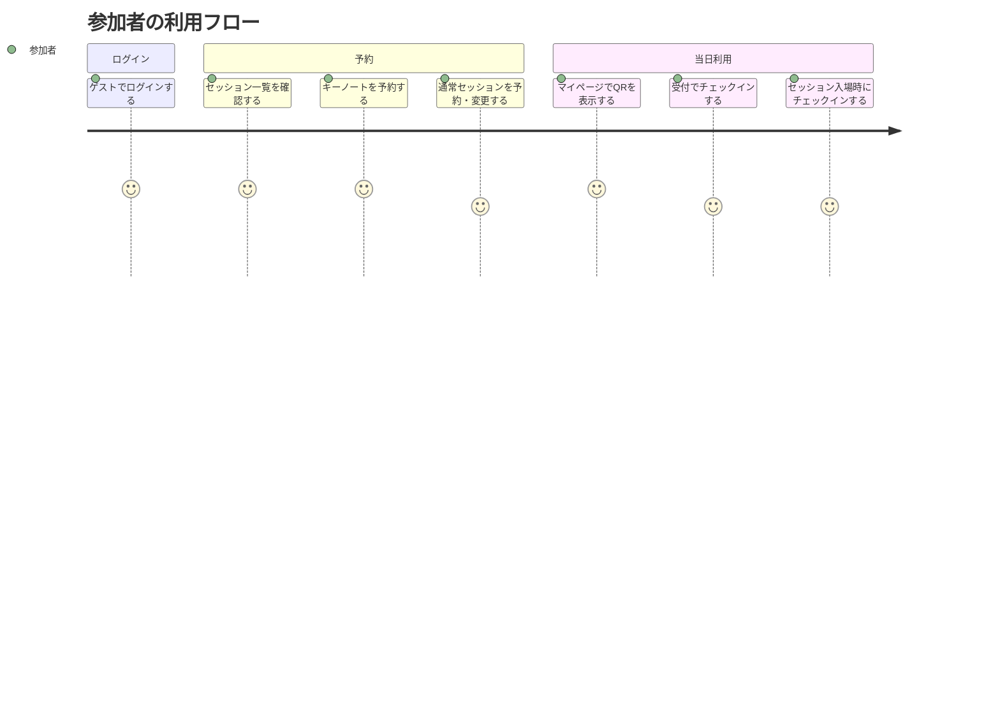
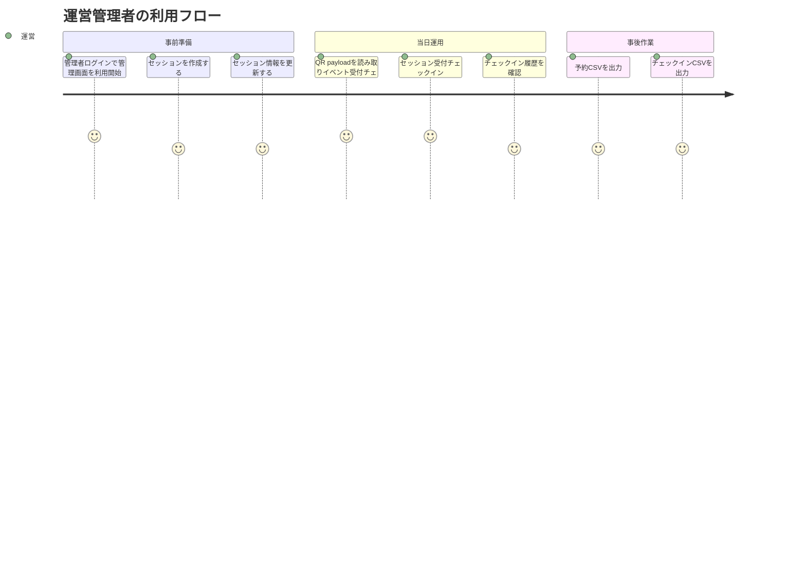

# ユーザージャーニー

## 1. 参加者（ゲスト）

```mermaid
journey
  title 参加者の利用フロー
  section ログイン
    ゲストでログインする: 5: 参加者
  section 予約
    セッション一覧を確認する: 5: 参加者
    キーノートを予約する: 5: 参加者
    通常セッションを予約・変更する: 4: 参加者
  section 当日利用
    マイページでQRを表示する: 5: 参加者
    受付でチェックインする: 4: 参加者
    セッション入場時にチェックインする: 4: 参加者
```

## 2. 運営管理者

```mermaid
journey
  title 運営管理者の利用フロー
  section 事前準備
    管理者ログインで管理画面を利用開始: 5: 運営
    セッションを作成する: 4: 運営
    セッション情報を更新する: 4: 運営
  section 当日運用
    QR payloadを読み取りイベント受付チェックイン: 5: 運営
    セッション受付チェックイン: 5: 運営
    チェックイン履歴を確認: 4: 運営
  section 事後作業
    予約CSVを出力: 4: 運営
    チェックインCSVを出力: 4: 運営
```

## 3. 主要タッチポイント

- 参加者UI: ゲストログイン、予約、マイページ、QR表示
- 運営UI: セッション管理、CSV出力、チェックイン
- API: 認証、予約、管理、チェックイン、エクスポート
