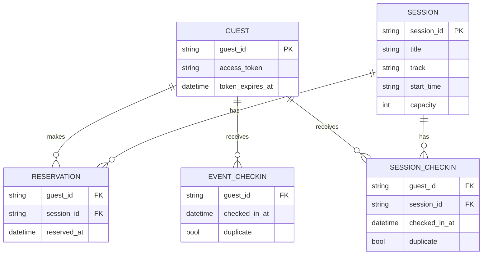

# ER図（論理モデル）

MVP実装ではインメモリ保持（Map）ですが、業務的な関係をERとして整理すると以下です。

## 制約

- `RESERVATION`: `(guest_id, session_id)` はユニーク
- 同時刻の `SESSION` に対して同一 `guest_id` の複数予約は禁止
- `SESSION.capacity` を超える予約は禁止
- チェックインは同一対象で重複時に `duplicate=true`
