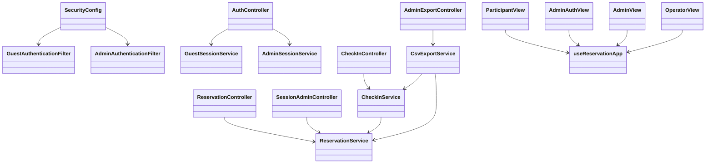

# クラス図（主要クラス / 2026-02-23時点）

```mermaid
classDiagram
    class SecurityConfig
    class GuestAuthenticationFilter
    class AdminAuthenticationFilter

    class GuestSessionService
    class AdminSessionService
    class ReservationService
    class CheckInService
    class CsvExportService

    class AuthController
    class ReservationController
    class SessionAdminController
    class CheckInController
    class AdminExportController

    class ParticipantView
    class AdminAuthView
    class AdminView
    class OperatorView
    class useReservationApp

    SecurityConfig --> GuestAuthenticationFilter
    SecurityConfig --> AdminAuthenticationFilter

    AuthController --> GuestSessionService
    AuthController --> AdminSessionService

    ReservationController --> ReservationService
    SessionAdminController --> ReservationService
    CheckInController --> CheckInService
    CheckInService --> ReservationService

    AdminExportController --> CsvExportService
    CsvExportService --> ReservationService
    CsvExportService --> CheckInService

    ParticipantView --> useReservationApp
    AdminAuthView --> useReservationApp
    AdminView --> useReservationApp
    OperatorView --> useReservationApp
```

## 補足

- `useReservationApp` がフロントの状態管理・API呼び出しを集約
- ルータガードで `/admin` への直接遷移時に管理セッション有無を判定
- `ReservationService` が `displayOrder` を含むセッション提示順制御を担う
