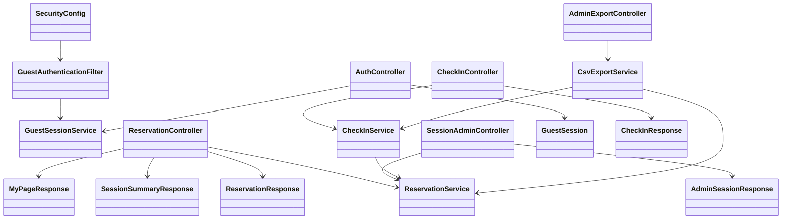

# クラス図（主要クラス）

```mermaid
classDiagram
    class SecurityConfig
    class GuestAuthenticationFilter
    class GuestSessionService
    class ReservationService
    class CheckInService
    class CsvExportService

    class AuthController
    class ReservationController
    class SessionAdminController
    class CheckInController
    class AdminExportController

    class GuestSession
    class ReservationResponse
    class SessionSummaryResponse
    class MyPageResponse
    class AdminSessionResponse
    class CheckInResponse

    SecurityConfig --> GuestAuthenticationFilter
    GuestAuthenticationFilter --> GuestSessionService

    AuthController --> GuestSessionService
    AuthController --> GuestSession

    ReservationController --> ReservationService
    ReservationController --> ReservationResponse
    ReservationController --> SessionSummaryResponse
    ReservationController --> MyPageResponse

    SessionAdminController --> ReservationService
    SessionAdminController --> AdminSessionResponse

    CheckInController --> CheckInService
    CheckInService --> ReservationService
    CheckInController --> CheckInResponse

    AdminExportController --> CsvExportService
    CsvExportService --> ReservationService
    CsvExportService --> CheckInService
```

## 補足

- `ReservationService` がセッションカタログ・予約状態・制約判定の中心
- `CheckInService` は予約状態を参照しつつチェックイン履歴を管理
- `CsvExportService` は予約情報とチェックイン情報を突合して出力
