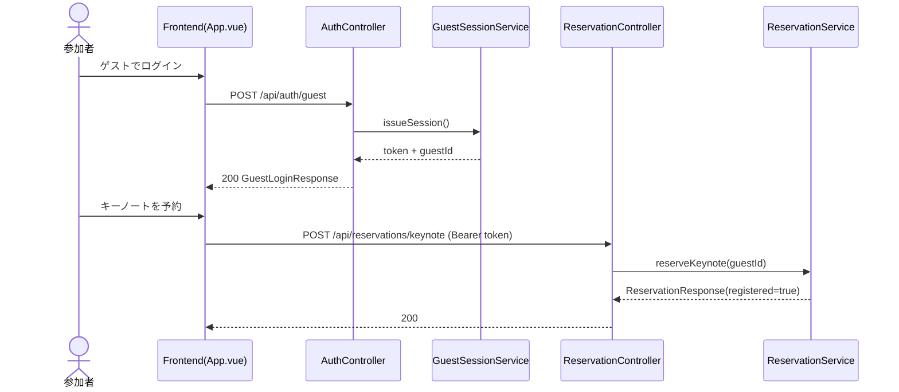
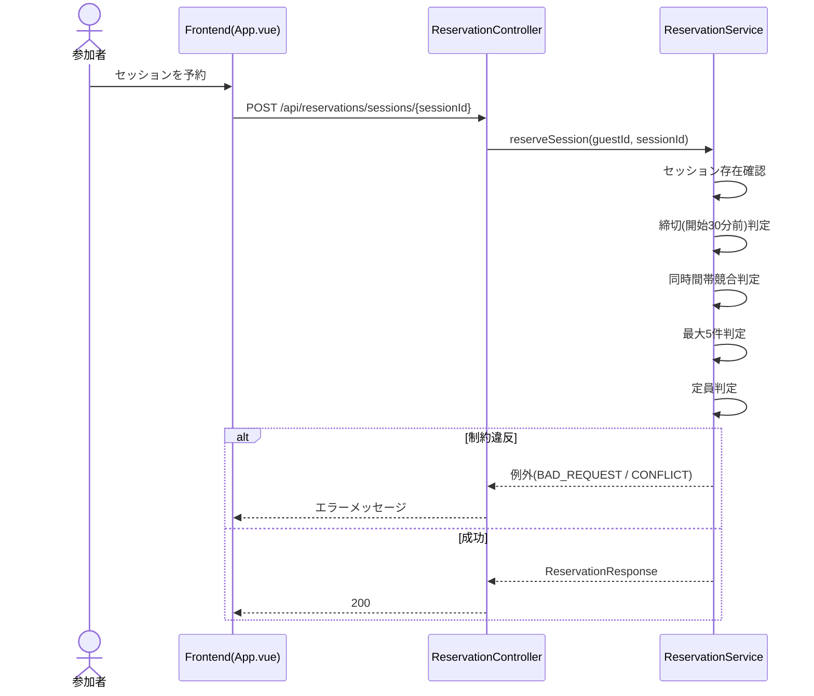
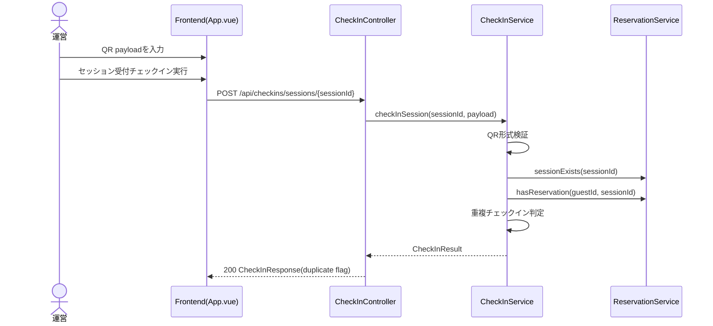

# 主要シーケンス図

## 1. ゲストログインからキーノート予約

```mermaid
sequenceDiagram
    actor Guest as 参加者
    participant UI as Frontend(App.vue)
    participant Auth as AuthController
    participant GS as GuestSessionService
    participant Res as ReservationController
    participant RS as ReservationService

    Guest->>UI: ゲストでログイン
    UI->>Auth: POST /api/auth/guest
    Auth->>GS: issueSession()
    GS-->>Auth: token + guestId
    Auth-->>UI: 200 GuestLoginResponse

    Guest->>UI: キーノートを予約
    UI->>Res: POST /api/reservations/keynote (Bearer token)
    Res->>RS: reserveKeynote(guestId)
    RS-->>Res: ReservationResponse(registered=true)
    Res-->>UI: 200
```

## 2. 通常セッション予約（制約判定あり）

```mermaid
sequenceDiagram
    actor Guest as 参加者
    participant UI as Frontend(App.vue)
    participant Res as ReservationController
    participant RS as ReservationService

    Guest->>UI: セッションを予約
    UI->>Res: POST /api/reservations/sessions/{sessionId}
    Res->>RS: reserveSession(guestId, sessionId)
    RS->>RS: セッション存在確認
    RS->>RS: 締切(開始30分前)判定
    RS->>RS: 同時間帯競合判定
    RS->>RS: 最大5件判定
    RS->>RS: 定員判定
    alt 制約違反
      RS-->>Res: 例外(BAD_REQUEST / CONFLICT)
      Res-->>UI: エラーメッセージ
    else 成功
      RS-->>Res: ReservationResponse
      Res-->>UI: 200
    end
```

## 3. QRチェックイン（イベント/セッション）

```mermaid
sequenceDiagram
    actor Staff as 運営
    participant UI as Frontend(App.vue)
    participant CI as CheckInController
    participant CS as CheckInService
    participant RS as ReservationService

    Staff->>UI: QR payloadを入力
    Staff->>UI: セッション受付チェックイン実行
    UI->>CI: POST /api/checkins/sessions/{sessionId}
    CI->>CS: checkInSession(sessionId, payload)
    CS->>CS: QR形式検証
    CS->>RS: sessionExists(sessionId)
    CS->>RS: hasReservation(guestId, sessionId)
    CS->>CS: 重複チェックイン判定
    CS-->>CI: CheckInResult
    CI-->>UI: 200 CheckInResponse(duplicate flag)
```
