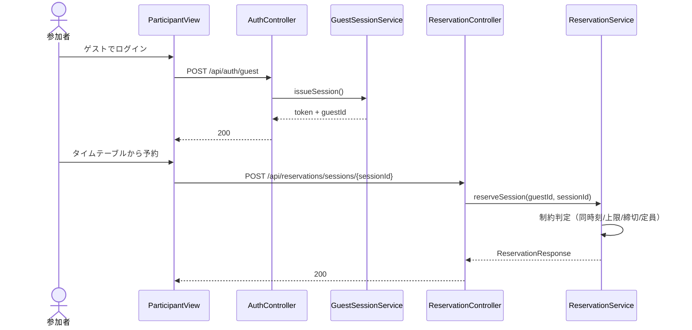
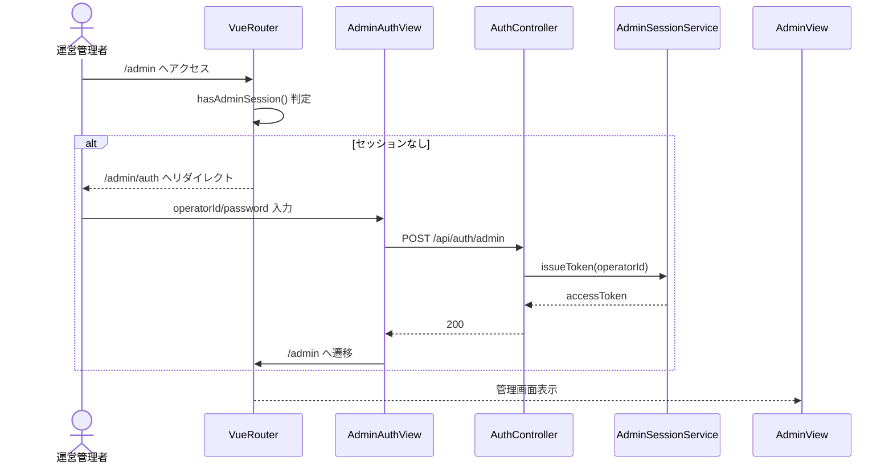
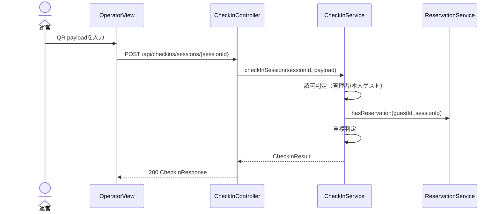

# 主要シーケンス図（2026-02-23時点）

## 1. 参加者ログインから予約

```mermaid
sequenceDiagram
    actor Guest as 参加者
    participant UI as ParticipantView
    participant Auth as AuthController
    participant GS as GuestSessionService
    participant Res as ReservationController
    participant RS as ReservationService

    Guest->>UI: ゲストでログイン
    UI->>Auth: POST /api/auth/guest
    Auth->>GS: issueSession()
    GS-->>Auth: token + guestId
    Auth-->>UI: 200

    Guest->>UI: タイムテーブルから予約
    UI->>Res: POST /api/reservations/sessions/{sessionId}
    Res->>RS: reserveSession(guestId, sessionId)
    RS->>RS: 制約判定（同時刻/上限/締切/定員）
    RS-->>Res: ReservationResponse
    Res-->>UI: 200
```

## 2. 管理者ログインと導線制御

```mermaid
sequenceDiagram
    actor Admin as 運営管理者
    participant Router as VueRouter
    participant AuthUI as AdminAuthView
    participant AuthApi as AuthController
    participant AS as AdminSessionService
    participant AdminUI as AdminView

    Admin->>Router: /admin へアクセス
    Router->>Router: hasAdminSession() 判定
    alt セッションなし
      Router-->>Admin: /admin/auth へリダイレクト
      Admin->>AuthUI: operatorId/password 入力
      AuthUI->>AuthApi: POST /api/auth/admin
      AuthApi->>AS: issueToken(operatorId)
      AS-->>AuthApi: accessToken
      AuthApi-->>AuthUI: 200
      AuthUI->>Router: /admin へ遷移
    end
    Router-->>AdminUI: 管理画面表示
```

## 3. チェックイン（権限制御あり）

```mermaid
sequenceDiagram
    actor Staff as 運営
    participant UI as OperatorView
    participant CI as CheckInController
    participant CS as CheckInService
    participant RS as ReservationService

    Staff->>UI: QR payloadを入力
    UI->>CI: POST /api/checkins/sessions/{sessionId}
    CI->>CS: checkInSession(sessionId, payload)
    CS->>CS: 認可判定（管理者/本人ゲスト）
    CS->>RS: hasReservation(guestId, sessionId)
    CS->>CS: 重複判定
    CS-->>CI: CheckInResult
    CI-->>UI: 200 CheckInResponse
```
